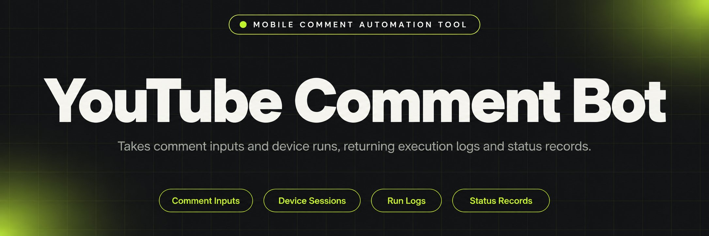
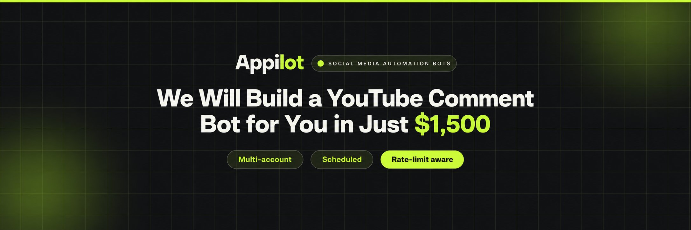
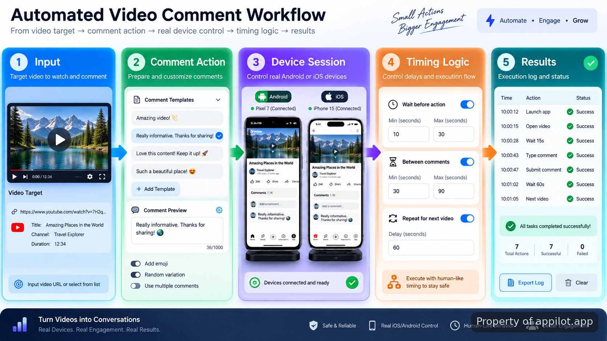

<p align="center">
  <a href="https://www.appilot.app" target="_blank" rel="nofollow">
    
  </a>
</p>

## youtube tools

youtube tools is a reference repository for running a YouTube comment automation approach through physical Android and iOS devices. The project shows how device-driven actions, timing controls, and comment preparation can be structured without relying on the YouTube API or emulator-only scripts. The repository focuses on the architecture behind a working automation flow: preparing inputs, connecting to a device, navigating the application interface, entering comments, and recording execution results.

> A real-device automation reference for controlled mobile interaction flows.

<a href="https://www.appilot.app" target="_blank" rel="nofollow">
  
</a>

<p align="center">
  <a href="https://t.me/Bitbash333" target="_blank" rel="nofollow">
    
  </a>&nbsp;
  <a href="https://wa.me/923249868488?text=Hi%2C%20I%27m%20interested." target="_blank" rel="nofollow">
    
  </a>&nbsp;
  <a href="mailto:hello@appilot.app" target="_blank" rel="nofollow">
    
  </a>&nbsp;
  <a href="https://www.appilot.app" target="_blank" rel="nofollow">
    
  </a>
</p>



## Real device automation approach

The repository demonstrates a device-first pattern where actions happen through a connected mobile device instead of a simulated browser environment. This matters when a workflow needs to reflect the same interface a person sees on a phone. The automation layer coordinates device access, screen actions, text entry, and run tracking while keeping each stage visible for debugging.

The implementation uses controlled comment timing and varied phrasing structures as part of the reference design. These mechanisms are intended to demonstrate how interaction sequences can be organized rather than guarantee platform acceptance or bypass restrictions. YouTube's Terms of Service and spam policies restrict automated behavior that creates misleading engagement or unwanted activity, so any deployment needs to follow current platform rules.

The architecture is intentionally different from API-driven publishing flows. The YouTube Data API provides official resources for comment operations, including comment retrieval and insertion methods, while this repository illustrates UI-level device interaction patterns instead. Reference documentation: <a href="https://developers.google.com/youtube/v3/guides/implementation/comments" target="_blank" rel="nofollow">YouTube Data API comment implementation</a> and <a href="https://developers.google.com/youtube/terms/developer-policies" target="_blank" rel="nofollow">YouTube API developer policies</a>.

## Core Features

| Feature | Description |
| --- | --- |
| Physical Device Control | The difficulty of reproducing phone behavior in scripts is reduced by directing actions through connected Android or iOS hardware with visible application states. |
| Comment Timing Rules | The problem of identical action sequences is addressed with configurable delays and pacing logic that make each run easier to inspect and adjust. |
| Phrase Preparation Layer | The challenge of repeated text handling is managed through structured comment inputs and controlled phrasing before device entry. |
| Execution Logging | The problem of unclear automation results is reduced by recording run stages, device events, and completion information for later review. |
| Mobile Automation Stack | The complexity of phone interaction is handled through tools such as Appium and Android Debug Bridge for device communication and automation control. |

## Technical stack and implementation

The stack is organized around mobile interaction rather than web requests. Appium provides a cross-platform automation layer for mobile interfaces, while Android Debug Bridge handles communication with Android hardware. The combination allows the repository structure to separate device sessions, action sequences, input preparation, and reporting.

Appium documentation describes its role in automating mobile applications across Android and iOS environments: <a href="https://appium.io/docs/en/latest/" target="_blank" rel="nofollow">Appium documentation</a>. Android Debug Bridge provides command-line communication between a development machine and Android devices: <a href="https://developer.android.com/tools/adb" target="_blank" rel="nofollow">Android Debug Bridge documentation</a>.

A typical execution path starts with a connected device check, loads prepared comment data, opens the application flow, performs interface actions, and stores the final state. The repository keeps these stages separate so a developer can replace individual components without changing the entire run sequence.

## Project Directory

```text
youtube-comment-device-reference/
├── src/
│   ├── device/
│   │   ├── session_manager.py
│   │   └── actions.py
│   ├── comments/
│   │   ├── phrases.py
│   │   └── scheduler.py
│   ├── reports/
│   │   └── logger.py
│   └── main.py
├── config/
│   └── settings.yaml
├── requirements.txt
└── README.md
```

<a href="https://tally.so/r/yP5oDx?platform=GitHub&amp;format=Product+repo&amp;brand=Appilot&amp;niche=appilot&amp;page=youtube+tools+for+Android+Devices&amp;date=2026-09-04" target="_blank" rel="nofollow">
  
</a>

## Mobile device automation workflow

The workflow is built around a visible sequence of actions. A run begins with a device connection, continues through prepared inputs, executes interface interactions, and finishes by writing status information. This makes failures easier to locate because each stage has a clear responsibility.

For example, a run can begin with a selected video reference, a prepared text entry, and a connected device session. The controller checks the session, performs the configured interaction steps, waits according to timing rules, and stores whether the sequence completed. This removes the common failure mode where an automation attempt appears successful without a record of what happened.

## Use Cases

- Testing mobile comment interaction flows where developers need device-level visibility instead of API-only simulations.
- Researching automation architecture patterns for teams evaluating Android automation or mobile device automation methods.
- Building internal prototypes that require logged device actions, controlled inputs, and repeatable execution steps.

## youtube tools setup and usage

**STEP 1 — Download & Set Up the Project** Download, set up, and install **youtube tools** to get the project running from the repository files and install the required dependencies.

**STEP 2 — Connect Device Session** Open the project and connect a prepared Android or iOS device so the automation controller can access the application interface.

**STEP 3 — Configure Inputs** Select comment data, timing values, and device settings in configuration files before starting the controlled interaction sequence.

**STEP 4 — Run Execution** Trigger the main command and review generated logs showing completed actions, device responses, and run status information.

```bash
python main.py
```

## Reference limitations and policy notes

This repository demonstrates an architectural approach only. Automated commenting on platforms with user-generated content requires careful review of platform rules, account permissions, and acceptable use requirements. YouTube policies restrict spam, deceptive engagement, and automated activity that harms community quality.

The repository does not claim to provide a guaranteed production deployment path. A maintained automation system requires ongoing review of platform changes, device behavior, application updates, and compliance requirements. The reference is intended for developers who need to understand the components involved in a real-device automation design.

## Development references

The implementation pattern depends on documented mobile automation standards and platform guidance. Useful references include <a href="https://appium.io/docs/en/latest/quickstart/install/" target="_blank" rel="nofollow">Appium installation documentation</a>, <a href="https://developer.android.com/tools" target="_blank" rel="nofollow">Android platform tools documentation</a>, and <a href="https://developers.google.com/youtube/v3/docs/comments" target="_blank" rel="nofollow">YouTube comment API references</a>.

External benchmarks and policy references are useful when evaluating automation behavior. The <a href="https://support.google.com/youtube/answer/2801973" target="_blank" rel="nofollow">YouTube spam policy</a> explains restrictions around repetitive or misleading engagement, while platform documentation should be reviewed before changing automation scope.

## FAQ

### Does this tool use the YouTube API to publish comments?

No. The repository demonstrates a real-device interaction approach rather than using the YouTube API for publishing comments. The project focuses on mobile interface control, device sessions, timing logic, and execution records.

### Can this repository be used for production comment automation?

The repository is a technical reference showing architecture patterns, not a complete maintained production deployment. Any production use requires platform policy review, operational controls, and ongoing maintenance.

### Why use real devices instead of emulator scripts?

Real devices provide direct visibility into mobile application behavior and allow the automation flow to follow the same interface states available on physical hardware. This helps developers inspect device actions and failures more clearly.

<table>
  <tr>
    <td align="center" width="33%">
      
      <p>This scraper helped me gather thousands of posts effortlessly. The setup was fast, and exports are super clean and well-structured.</p>
      <p><b>Nathan Pennington</b><br>Marketer<br>★★★★★</p>
    </td>
    <td align="center" width="33%">
      
      <p>What impressed me most was how accurate the extracted data is. Likes, comments, timestamps — everything aligns perfectly.</p>
      <p><b>Greg Jeffries</b><br>SEO Affiliate Expert<br>★★★★★</p>
    </td>
    <td align="center" width="33%">
      
      <p>It's by far the best tool I've used. Ideal for trend tracking, competitor monitoring, and influencer insights.</p>
      <p><b>Karan</b><br>Digital Strategist<br>★★★★★</p>
    </td>
  </tr>
</table>